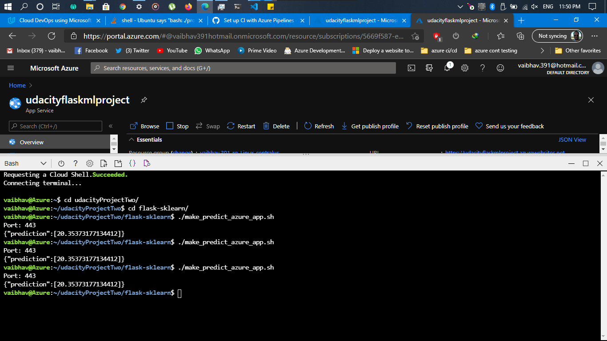
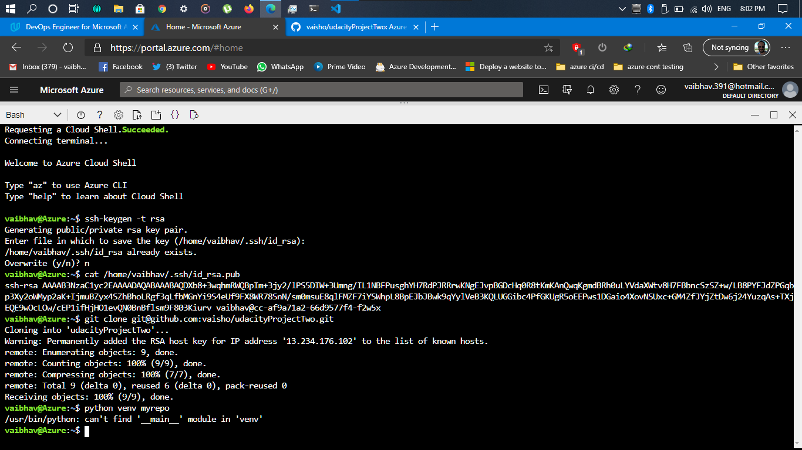
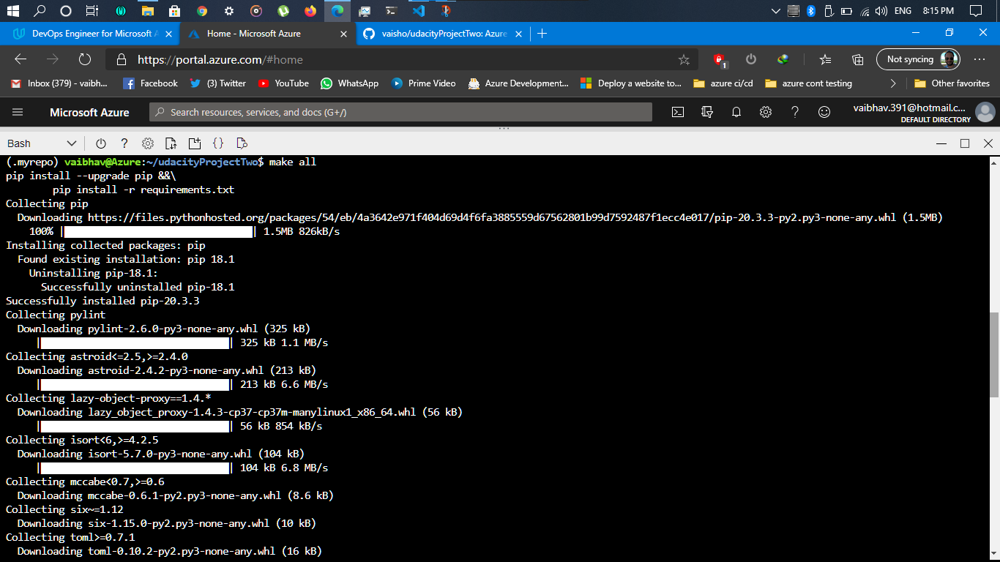
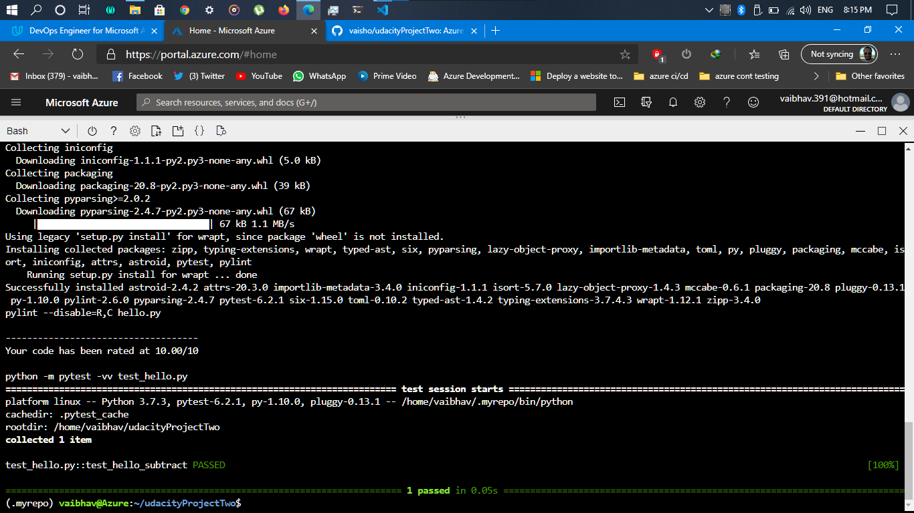
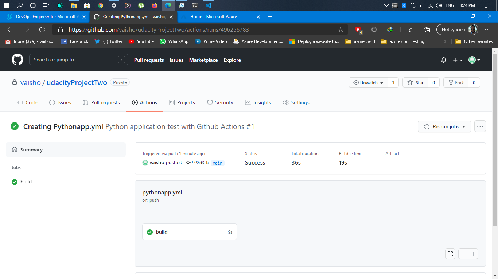
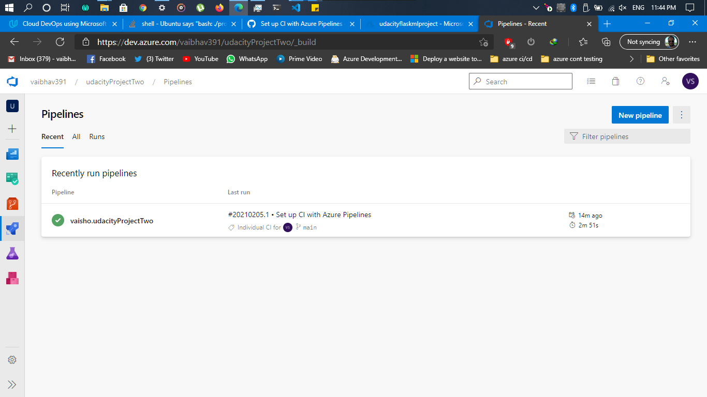
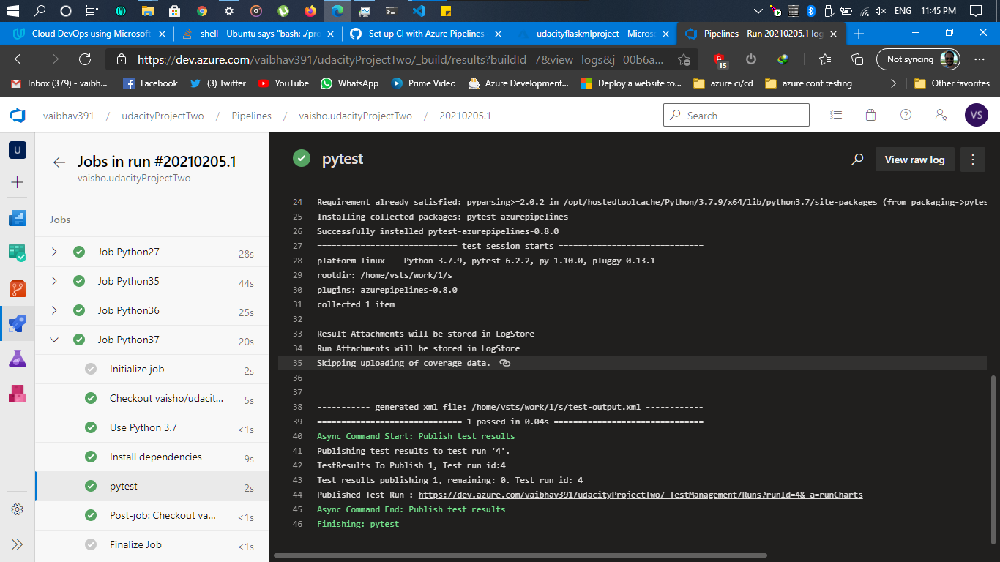
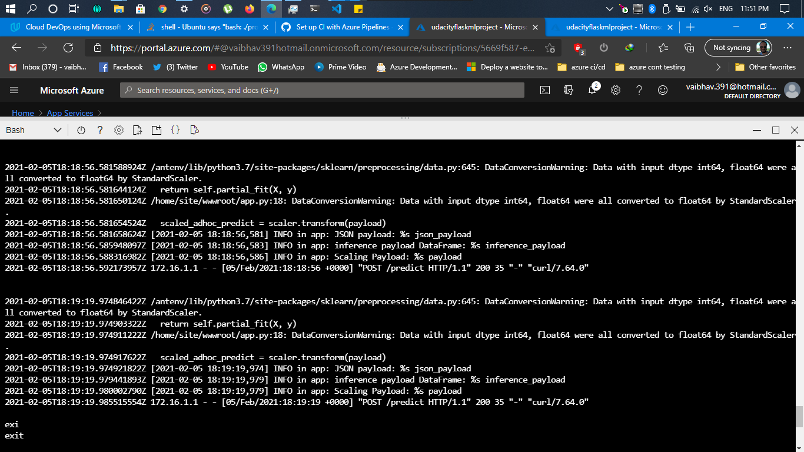

# Overview

<TODO: complete this with an overview of your project>
This is a demo project for udacity nano-degree program , here we will implement the devops princile of CI and CD using the Azure DevOps , dev.azure.com .
The objective is to build a python app which will use flask ML to predict the rates of housing properties. The flask part will be used as boiler plate code and main focus will be on how to deploy this flask app ML prediciton as an azure webapp using the CI CD pipeline using azure devops.


## Project Plan
<TODO: Project Plan

* A link to a Trello board for the project
* A link to a spreadsheet that includes the original and final project plan>

## Instructions

Instructions for running the Python project:

1. Clone or fork the repo first.
2. you'll need azure account to deploy the app locally in the azure portal , once you have that, run the following command in azure CLI
    ssh-keygen -t rsa 
3. create a python virtual environmen by running :
    python3 -m venv ~/.flask-ml-azure
    source ~/.flask-ml-azure/bin/activate
    make install
    
4. chnage directory to your project root / flask-sklearn and deploy your webapp
    az webapp up -n udacityflaskmlproject
5. Make an account on Azure DevOps(dev.azure.com), create your organisation tree and create a new project.
6. Add your the git repo with this clone or fork
7. select the python app and your YML file would be generated. Copy and paste the content from the YML in the repo to the YML generated by devops, then commit.
8. Now everytime a new git push happens azure devops will run all tests and deploy the app with the changes.
    

* Project running on Azure App Service 


* Project cloned into Azure Cloud Shell
     
  
* Passing tests that are displayed after running the `make all` command from the `Makefile`






* Output of a test run


* Successful deploy of the project in Azure Pipelines.  [Note the official documentation should be referred to and double checked as you setup CI/CD](https://docs.microsoft.com/en-us/azure/devops/pipelines/ecosystems/python-webapp?view=azure-devops).



* Running Azure App Service from Azure Pipelines automatic deployment





* Successful prediction from deployed flask app in Azure Cloud Shell.  [Use this file as a template for the deployed prediction](https://github.com/udacity/nd082-Azure-Cloud-DevOps-Starter-Code/blob/master/C2-AgileDevelopmentwithAzure/project/starter_files/flask-sklearn/make_predict_azure_app.sh).
The output should look similar to this:

```bash
udacity@Azure:~$ ./make_predict_azure_app.sh
Port: 443
{"prediction":[20.35373177134412]}
```


* Output of streamed log files from deployed application


> 

## Enhancements

In order to learn more how the azure devops work , you can implemet a kubernetes version of the same project.

## Demo 

<TODO: Add link Screencast on YouTube>


